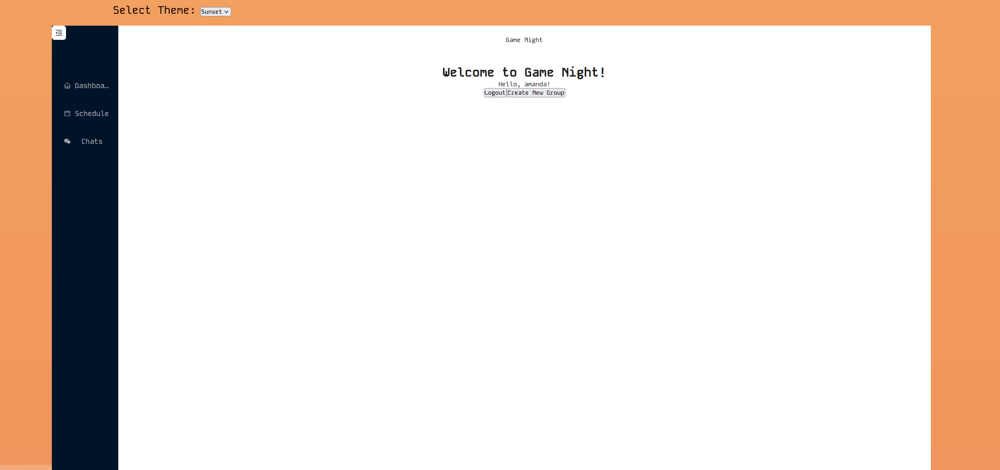

# Game Night

## Description

  We have created an application that allows users to form groups and utilize a scheduler so everyone can decide the best available times to get together and game!

## Table of Contents

- [Installation](#installation)
- [Usage](#usage)
- [License](#license)
- [Contributions](#contributions)
- [Testing](#testing)

## Installation

Note: This project is deployed for everyday use [here]. Otherwise, you can follow the instructions to run it locally.

1. Download the source code.
2. `npm i` the dependencies.
3. `npm run start` from `./client/src/App.jsx`

## Usage

This project is deployed via Heroku and can be found [here]. To use the project, create an account. After that, join or create a group to access a group calendar. Once in a group, block off days that you are unavailable so other users can add what times work for them or what doesn't.

## Application Link
# https://glacial-stream-96074-464bdf1b26a2.herokuapp.com/ 

## License

This project was created under the MIT license.

## Contributions

This project was made by [Amanda Norris](https://github.com/whimsically), [Jennifer Dang](https://github.com/jxdang1), [Maya Hernandez](https://github.com/MayaH2000), and [Evan Hatley](https://github.com/evan-hatley).

## Testing

This project was tested with GraphQL, ensuring that CRUD operations all work as expected.
